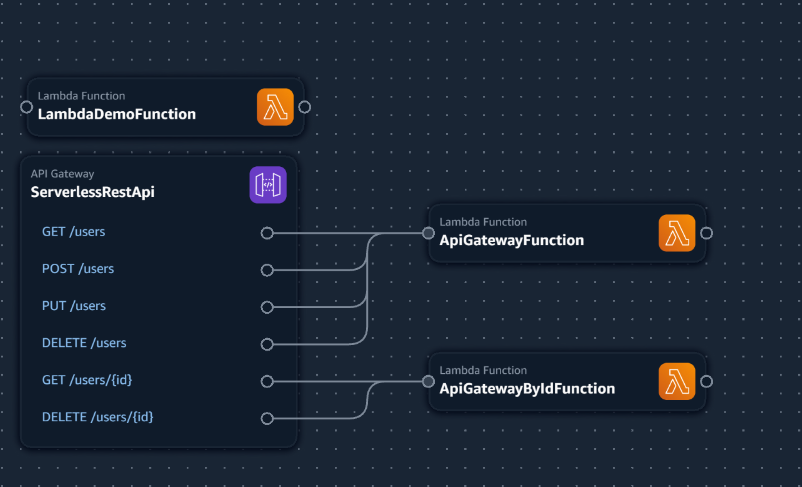

# Lambda Template For Local Testing and Debugging

## Overview

This repository contains Lambda function templates configured to run locally using AWS SAM (Serverless Application Model) Local. It provides a convenient setup for developing, testing, and debugging Lambda functions on your local machine before deploying them to the AWS Cloud.

## Prerequisites

Before getting started, make sure you have the following prerequisites installed on your local machine:

- [Docker](https://www.docker.com/products/docker-desktop/)
- [AWS SAM CLI](https://docs.aws.amazon.com/serverless-application-model/latest/developerguide/serverless-sam-cli-install.html)
- [Node.js](https://nodejs.org/) (for JavaScript Lambda functions)

## Getting Started

- Clone this repository to your local machine:

  ```
   git clone https://github.com/kiranpoojary/lambda-local-testing.git
  ```

- Navigate to the project directory:

  ```
   cd lambda-local-testing
  ```

  # Execution

- **How to execute lambda function as EVENT with event.json file**

```
 sam local invoke -e event.json LambdaDemoFunction
```

- **How to execute lambda function as REST API with api.json file**

```
 sam local invoke -e api.json ApiGatewayFunction
```

- **How to start lambda function as REST API with api.json file**

```
 sam local start-api
```

## API endpoint you can try

Mounting ApiGatewayFunction at `http://127.0.0.1:3000/users` **_[DELETE, GET, POST, PUT]_**
Mounting ApiGatewayByIdFunction at `http://127.0.0.1:3000/users/{id}` **_[DELETE, GET]_**

### Architecture



**_Happy Coding...._**
